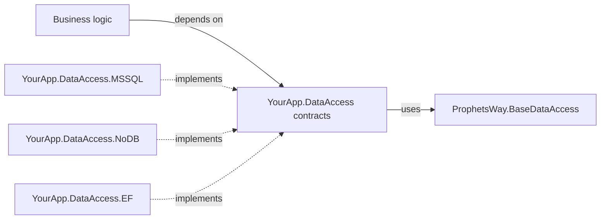
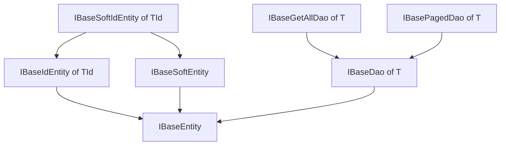
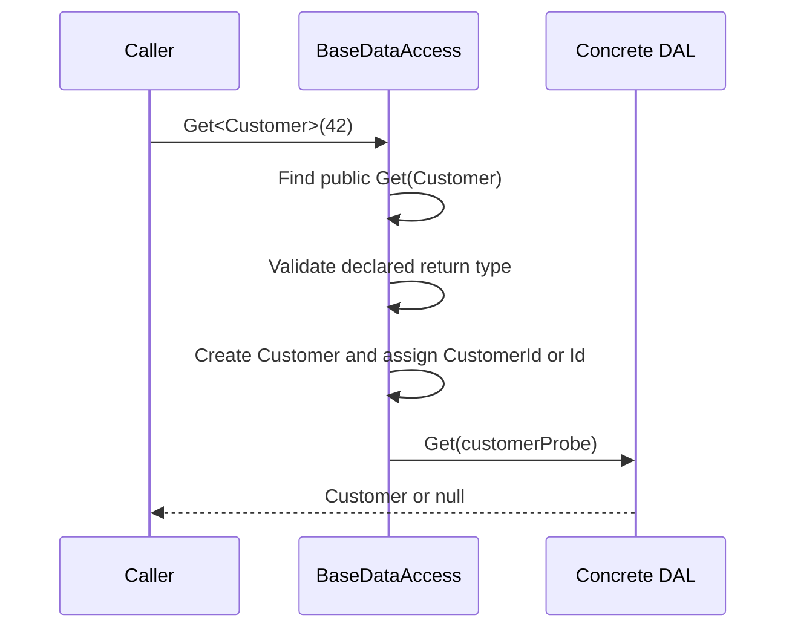

# ProphetsWay.BaseDataAccess

Define your data-access contracts once, keep business logic independent of storage technology, and replace the DAL without rewriting its consumers.

[](https://dev.azure.com/ProphetsWay/ProphetsWay%20GitHub%20Projects/_build/latest?definitionId=23&repoName=ProphetManX%2FProphetsWay.BaseDataAccess&branchName=main)


## Why BaseDataAccess

When domain models and persistence APIs live inside a specific DAL implementation, business logic becomes coupled to that database or framework. Replacing Entity Framework, a SQL provider, or even the storage model then becomes an application-wide change.

BaseDataAccess gives you storage-neutral entity and DAO contracts. Your business layer depends on those contracts, while each Data Access Layer (DAL) implementation satisfies them independently.

### Highlights

- Swap DAL implementations while keeping the business-facing contract stable.
- Give each entity a strongly typed DAO surface with optional CRUD, list, and paging contracts.
- Expose one aggregate data-access interface for dependency injection and testing.
- Use generic CRUD dispatch when it helps, or implement `IBaseDataAccess` directly when reflection is not appropriate.
- Mix identifier types across entities; generic `Get<T>(object id)` does not impose one key type on the whole DAL.

## Install

With the .NET CLI:

```text
dotnet add package ProphetsWay.BaseDataAccess
```

With the NuGet Package Manager Console:

```powershell
Install-Package ProphetsWay.BaseDataAccess
```

Targets: .NET Standard 2.0, .NET Framework 4.8, .NET 8.0, and .NET 9.0.

## Quick Start

Create a contracts project such as `YourApp.DataAccess`. Put its entities, DAO interfaces, and aggregate DAL interface there so neither the business layer nor the contracts project references a storage implementation.

> **Illustrative** — not currently present in the repo.

```csharp
using ProphetsWay.BaseDataAccess;

public sealed class Customer : IBaseIdEntity<int>
{
    public int Id { get; set; }
    public string Name { get; set; }
}

public interface ICustomerDao : IBasePagedDao<Customer> { }

public interface IAppDataAccess : IBaseDataAccess, ICustomerDao { }
```

Your business services can now depend on `IAppDataAccess`. A project such as `YourApp.DataAccess.MSSQL`, `YourApp.DataAccess.MySQL`, `YourApp.DataAccess.Oracle`, `YourApp.DataAccess.SQLite`, or `YourApp.DataAccess.EF` supplies the implementation without leaking that technology into the contract.

## Core Concepts

### Contracts stay above implementations

The package supplies a vocabulary for the boundary between business logic and persistence. `IBaseEntity` marks participating entities, the DAO interfaces describe entity-specific operations, and `IBaseDataAccess` describes operations shared by the complete DAL.



The implementation dependency points inward toward the contract. The contracts project must not reference a provider-specific implementation or expose types such as `DbContext` or `SqlConnection`.

### DAO contracts compose by capability

`IBaseDao<T>` defines CRUD. `IBaseGetAllDao<T>` and `IBasePagedDao<T>` independently add retrieval capabilities, so an entity exposes only the operations it needs. Add domain-specific members to the entity DAO rather than forcing them into a universal repository abstraction.



`IBaseGetAllDao<T>` and `IBasePagedDao<T>` are siblings. Paging does not imply that loading every record is available.

### Generic dispatch is optional

`BaseDataAccess` implements the generic members of `IBaseDataAccess` by locating an exact public instance overload on the derived DAL. This lets callers write `dal.Get<Customer>(id)` while the concrete DAL keeps strongly typed methods such as `Get(Customer item)`.



Reflection is a convenience, not a requirement. You can override the virtual generic methods, or implement `IBaseDataAccess` directly, when you want explicit dispatch or need to avoid reflection.

## API Reference

### Entity contracts

| Type | Member | Purpose |
| --- | --- | --- |
| `IBaseEntity` | Marker interface | Identifies an entity that can participate in the DAL contracts. |
| `IBaseIdEntity<T>` | `T Id { get; set; }` | Adds a strongly typed `Id` property. |
| `IBaseSoftEntity` | `CreatedDate`, `UpdatedDate`, `DeletedDate` | Carries timestamps for creation, updates, and soft deletion. It does not itself implement delete behavior. |
| `IBaseSoftIdEntity<T>` | Combined contract | Combines `IBaseSoftEntity` and `IBaseIdEntity<T>`. |

### DAO contracts

| Type | Member | Purpose |
| --- | --- | --- |
| `IBaseDao<T>` | `Get(T)` | Retrieves one entity using the identifying values on the supplied entity. |
| `IBaseDao<T>` | `Insert(T)` | Inserts an entity. The contract permits the implementation to assign its ID. |
| `IBaseDao<T>` | `Update(T)` | Updates an entity and returns the affected-row count. |
| `IBaseDao<T>` | `Delete(T)` | Deletes an entity and returns the affected-row count. |
| `IBaseGetAllDao<T>` | `GetAll(T)` | Retrieves all entities of `T`; the argument disambiguates the entity overload. |
| `IBasePagedDao<T>` | `GetPaged(T, int skip, int take)` | Retrieves a subset of entities. |
| `IBasePagedDao<T>` | `GetCount(T)` | Returns the total count used to calculate paging bounds. |

### Aggregate DAL contracts

| Type | Member | Purpose |
| --- | --- | --- |
| `IBaseDataAccess` | `Get<T>(object id)` | Retrieves an entity by assigning the ID to a new probe entity. |
| `IBaseDataAccess` | `GetAll<T>()` | Dispatches to `GetAll(T)` without requiring the caller to create a probe. |
| `IBaseDataAccess` | `GetPaged<T>(int skip, int take)` | Dispatches to `GetPaged(T, int, int)`. |
| `IBaseDataAccess` | `GetCount<T>()` | Dispatches to `GetCount(T)`. |
| `IBaseDataAccess` | `Insert<T>(T)`, `Update<T>(T)`, `Delete<T>(T)` | Exposes generic write operations. |
| `IBaseDataAccess` | `TransactionStart()`, `TransactionCommit()`, `TransactionRollBack()` | Lets business logic coordinate multiple DAL calls in one transaction. |
| `BaseDataAccess` | Virtual generic operations | Provides the reflection-based implementation of the generic operations. |
| `DataAccessConventionException` | Exception type | Reports deterministic method, return-type, or identifier-property wiring errors. |

## The BaseDataAccess Convention

If your concrete DAL inherits `BaseDataAccess`, each generic call requires an exact public instance method. Entity parameters cannot be replaced by `IBaseEntity`, a base class, or another assignable type.

| Generic call | Required concrete method | Required declared return type |
| --- | --- | --- |
| `Get<T>(id)` | `Get(T)` | `T` or a subclass of `T` |
| `GetAll<T>()` | `GetAll(T)` | Assignable to `IList<T>` |
| `GetPaged<T>(skip, take)` | `GetPaged(T, int, int)` | Assignable to `IList<T>` |
| `GetCount<T>()` | `GetCount(T)` | `int` |
| `Insert<T>(item)` | `Insert(T)` | Unconstrained; the result is discarded |
| `Update<T>(item)` | `Update(T)` | `int` |
| `Delete<T>(item)` | `Delete(T)` | `int` |

For `Get<T>(id)`, the dispatcher creates `T` and sets `{TypeName}Id` first, falling back to `Id`. The property must have a setter. Other operations do not require either property.

The dispatcher validates the method and its declared return type before invoking it. A bad `Update` or `Delete` signature therefore fails before it can write data. Exceptions thrown by the concrete DAL, the entity constructor, or the identifier setter reach the caller as their original types with their original stack traces; they are not wrapped in `TargetInvocationException`.

`Get<T>`, `GetAll<T>`, and `GetPaged<T>` may return `null`. Collection return values should be treated as read-only because arrays satisfy `IList<T>` but do not support mutation.

## Common Scenarios

### Compose one business-facing DAL contract

The companion [ProphetsWay.Example](https://github.com/ProphetManX/ProphetsWay.Example) project uses an interface of interfaces. This is real code from that repository:

```csharp
using ProphetsWay.BaseDataAccess;
using ProphetsWay.Example.DataAccess.IDaos;

namespace ProphetsWay.Example.DataAccess
{
    public interface IExampleDataAccess : IBaseDataAccess, ICompanyDao, IJobDao,
        IUserDao, ITransactionDao, IResourceDao
    {
    }
}
```

Consumers depend on `IExampleDataAccess`, not on its NoDB or Entity Framework implementation.

### Add entity-specific operations

DAO interfaces can extend a base capability and add domain-specific queries. The Example project defines:

```csharp
using ProphetsWay.BaseDataAccess;
using ProphetsWay.Example.DataAccess.Entities;

namespace ProphetsWay.Example.DataAccess.IDaos
{
    public interface ICompanyDao : IBasePagedDao<Company>
    {
        Company GetCustomCompanyFunction(int id);
    }
}
```

### Call through the generic surface

The in-repo test suite verifies this call shape against a well-formed concrete DAL:

```csharp
var dal = new WellFormedDataAccess();
dal.GetResult = new Company { CompanyId = 99, Name = "Returned" };

var result = dal.Get<Company>(42);
```

The dispatcher passes a `Company` probe whose `CompanyId` is `42` to the concrete `Get(Company)` overload and returns that overload's result unchanged.

## Architecture & Design Decisions

### Why methods accept an entity parameter

Every entity-specific DAO uses the same operation names. Passing `T` gives each overload a unique CLR signature, allowing one aggregate interface and implementation to expose `Get(Company)`, `Get(User)`, and other entity operations together. For `GetAll`, `GetCount`, and `GetPaged`, the parameter is a type discriminator and the generic dispatcher passes `null`.

If this convention does not fit your API, define explicit methods such as `GetCustomer(int customerId)` in your own DAO interfaces and implement `IBaseDataAccess` without inheriting `BaseDataAccess`.

### Why contracts and implementations are separate projects

A typical solution uses a base contracts project and one project per replaceable implementation:

```text
YourApp.DataAccess
|- Entities/
|- IDaos/
`- IYourAppDataAccess.cs

YourApp.DataAccess.MSSQL
|- Daos/
`- YourAppDataAccess.cs
```

The contracts project owns the models used by the rest of the application. Every implementation adapts its storage technology to those models, rather than making business logic consume provider-generated entities. Focused concrete DAO classes can remain internal; only the aggregate DAL needs to be available to consumers.

### Reflection trade-off

The generic dispatcher removes repetitive type switches and probe construction from callers, but reflection adds runtime convention checks and overhead. The convention is strict and deterministic, and its failures use `DataAccessConventionException` with the offending type and signature. Applications with tighter performance requirements can override the virtual members or avoid the abstract base class entirely.

### Soft-delete contracts describe data, not policy

`IBaseSoftEntity` standardizes lifecycle timestamps. It does not automatically filter deleted rows or turn `Delete` into an update; each DAL implementation owns that behavior.

## Building & Testing Locally

```powershell
git clone https://github.com/ProphetManX/ProphetsWay.BaseDataAccess
cd ProphetsWay.BaseDataAccess
dotnet restore
dotnet build
dotnet test
```

The `ProphetsWay.BaseDataAccess.Tests` project contains 68 xUnit tests covering dispatch, method lookup, return types, identifier assignment, null behavior, struct entities, shadowed methods, and exception propagation. The companion [ProphetsWay.Example](https://github.com/ProphetManX/ProphetsWay.Example) repository demonstrates the same contracts with a NoDB implementation; the EFTools repository supplies an Entity Framework implementation.

## Contributing

Keep public contracts storage-neutral and preserve the exact reflection convention when changing `BaseDataAccess`. Add or update xUnit tests for behavioral changes, use Shouldly assertions, and run the full test suite before submitting a change.

## Versioning

This project follows [Semantic Versioning](http://semver.org/). Available releases are listed in the [repository tags](https://github.com/ProphetManX/ProphetsWay.BaseDataAccess/tags).

## Authors

Created by [G. Gordon Nasseri](https://github.com/ProphetManX). See the repository's [contributors](https://github.com/ProphetManX/ProphetsWay.BaseDataAccess/graphs/contributors) for additional participants.

## Changelog

See [CHANGELOG.md](CHANGELOG.md). Version 3.0.0 introduced strict convention validation, unwrapped implementation exceptions, consolidated target frameworks, and the in-repo test suite.

## License

MIT License - see [LICENSE](LICENSE).
