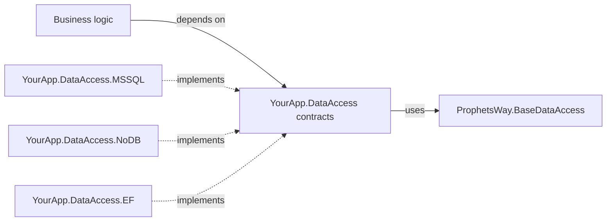
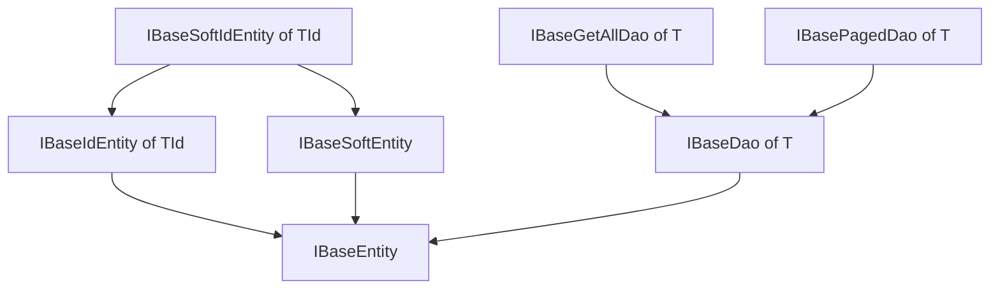
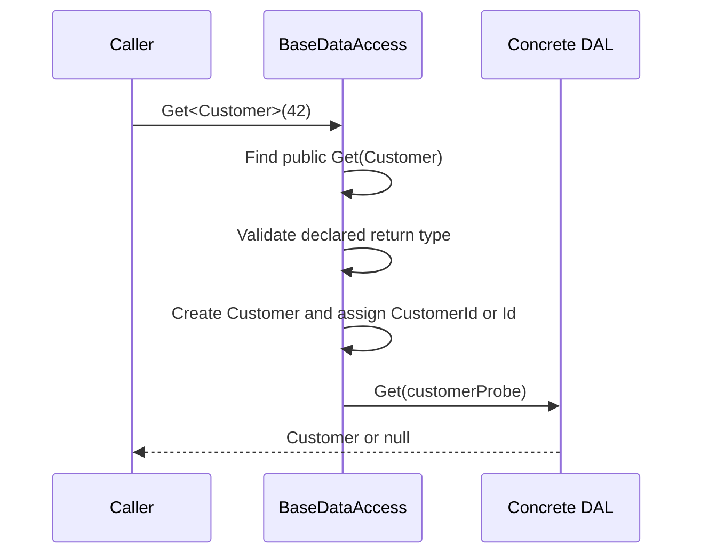

# ProphetsWay.BaseDataAccess

Define your data-access contracts once, keep business logic independent of storage technology, and replace the DAL without rewriting its consumers.

[](https://dev.azure.com/ProphetsWay/ProphetsWay%20GitHub%20Projects/_build/latest?definitionId=23&repoName=ProphetManX%2FProphetsWay.BaseDataAccess&branchName=main)


## Why BaseDataAccess

When domain models and persistence APIs live inside a specific DAL implementation, business logic becomes coupled to that database or framework. Replacing Entity Framework, a SQL provider, or even the storage model then becomes an application-wide change.

BaseDataAccess gives you storage-neutral entity and DAO contracts. Your business layer depends on those contracts, while each Data Access Layer (DAL) implementation satisfies them independently.

### Highlights

- Swap DAL implementations while keeping the business-facing contract stable.
- Give each entity a strongly typed DAO surface with optional CRUD, list, and paging contracts.
- Expose one aggregate data-access interface for dependency injection and testing.
- Use generic CRUD dispatch when it helps, or implement `IBaseDataAccess` directly when reflection is not appropriate.
- Mix identifier types across entities; generic `Get<T>(object id)` does not impose one key type on the whole DAL.
- Work against a written transaction contract — one transaction per instance, no nesting, rolled back on disposal — instead of guessing what each DAL means by "commit".
- Work against a written disposal contract. `IBaseDataAccess` extends `IDisposable`, so a DAL fits a `using` block and a dependency-injection scope without special handling.

## Install

With the .NET CLI:

```text
dotnet add package ProphetsWay.BaseDataAccess
```

With the NuGet Package Manager Console:

```powershell
Install-Package ProphetsWay.BaseDataAccess
```

Targets: .NET Standard 2.0 and .NET 10.0.

As of 3.1.0 the package ships those two assets only — the dedicated `net48`, `net8.0`, and `net9.0` assets are gone, and **that strands nobody**. `netstandard2.0` is consumable by .NET Framework 4.6.1 and later and by every .NET Core and .NET 5+ runtime, so a .NET Framework, .NET 8, or .NET 9 project still installs this package and still resolves an asset.

The test project targets `net48;net10.0`, deliberately. A `net48` test leg is how .NET Framework *behavior* is verified, which is a different thing from the library merely *supporting* Framework through `netstandard2.0`.

## Quick Start

Create a contracts project such as `YourApp.DataAccess`. Put its entities, DAO interfaces, and aggregate DAL interface there so neither the business layer nor the contracts project references a storage implementation.

> **Illustrative** — not currently present in the repo.

```csharp
using ProphetsWay.BaseDataAccess;

public sealed class Customer : IBaseIdEntity<int>
{
    public int Id { get; set; }
    public string Name { get; set; }
}

public interface ICustomerDao : IBasePagedDao<Customer> { }

public interface IAppDataAccess : IBaseDataAccess, ICustomerDao { }
```

Your business services can now depend on `IAppDataAccess`. A project such as `YourApp.DataAccess.MSSQL`, `YourApp.DataAccess.MySQL`, `YourApp.DataAccess.Oracle`, `YourApp.DataAccess.SQLite`, or `YourApp.DataAccess.EF` supplies the implementation without leaking that technology into the contract.

`IBaseDataAccess` extends `IDisposable`, so whoever owns the instance disposes it:

> **Illustrative** — not currently present in the repo.

```csharp
using (IAppDataAccess dal = new InMemoryAppDataAccess())
{
    dal.Insert(new Customer { Name = "Acme" });

    var page = dal.GetPaged<Customer>(0, 25);
    var total = dal.GetCount<Customer>();
}
```

[Implement one aggregate DAL](#implement-one-aggregate-dal) shows everything `InMemoryAppDataAccess` has to supply, including the `Dispose` override that 3.0.0 made mandatory.

## Core Concepts

### Contracts stay above implementations

The package supplies a vocabulary for the boundary between business logic and persistence. `IBaseEntity` marks participating entities, the DAO interfaces describe entity-specific operations, and `IBaseDataAccess` describes operations shared by the complete DAL.



The implementation dependency points inward toward the contract. The contracts project must not reference a provider-specific implementation or expose types such as `DbContext` or `SqlConnection`.

### DAO contracts compose by capability

`IBaseDao<T>` defines CRUD. `IBaseGetAllDao<T>` and `IBasePagedDao<T>` independently add retrieval capabilities, so an entity exposes only the operations it needs. Add domain-specific members to the entity DAO rather than forcing them into a universal repository abstraction.



`IBaseGetAllDao<T>` and `IBasePagedDao<T>` are siblings. Paging does not imply that loading every record is available.

### Generic dispatch is optional

`BaseDataAccess` implements the generic members of `IBaseDataAccess` by locating an exact public instance overload on the derived DAL. This lets callers write `dal.Get<Customer>(id)` while the concrete DAL keeps strongly typed methods such as `Get(Customer item)`.



Reflection is a convenience, not a requirement. You can override the virtual generic methods, or implement `IBaseDataAccess` directly, when you want explicit dispatch or need to avoid reflection.

### The `item` parameter is a type selector, never data

`GetAll(T item)`, `GetPaged(T item, int, int)`, and `GetCount(T item)` take an entity parameter for exactly one reason: to give each entity's overload a distinct CLR signature. **Nothing is read from it, and an implementation must never read it.** When the call arrives through `BaseDataAccess`, the dispatcher passes a literal `null` — materialized as `default(T)` when the entity is a `struct`.

Dereferencing that parameter compiles cleanly and throws `NullReferenceException` the first time a caller uses the generic surface.

> **Illustrative** — not currently present in the repo. Both lines are bodies on a DAL implementing `IBaseGetAllDao<Customer>` over a `List<Customer> _customers`.

```csharp
//throws when the call comes through the generic dispatcher - item is null
public IList<Customer> GetAll(Customer item) => _customers.Where(c => c.Name == item.Name).ToList();

//the parameter selects the type and nothing else
public IList<Customer> GetAll(Customer item) => _customers.ToList();
```

`IBaseDao<T>.Get(T item)` is the exception. There the argument carries the identifier and is genuinely read.

### Transactions are a scalpel, not an ambient system

`TransactionStart()`, `TransactionCommit()`, and `TransactionRollBack()` exist for one narrow job: making a bounded batch of writes atomic, so a complex set of records either all persist or none of them do. Open one, do the batch, close it. They are not an ambient transaction system and not a unit-of-work framework. The contract binds every implementation:

| Rule | Consequence |
| --- | --- |
| One transaction per DAL instance | A second `TransactionStart()` while one is open throws `InvalidOperationException`. Transactions do not nest. |
| Scope is the instance, not the connection | Two DAL instances over the same database do not share a transaction; work done through one is not enrolled in the other's. |
| Commit and rollback require an open transaction | Calling either with nothing open throws `InvalidOperationException`, including on a second call. |
| A failed commit closes the transaction and discards its writes | Do not follow a failed commit with `TransactionRollBack()`. Nothing is left to roll back and that call throws. |
| No transaction open means auto-commit | A single write does not need a transaction to be durable. |
| Ambient transactions are left alone | These members neither create nor suppress a `TransactionScope`; whatever your provider already does inside an enclosing scope keeps happening. |
| Disposal rolls back | A transaction still open when the instance is disposed is rolled back, never committed. An unclosed transaction is an abandoned one. |

Transaction state lives on the instance, so an instance with a transaction open **must not be used from more than one thread** while that transaction is open. Beyond that single consequence, this library makes no thread-safety guarantee.

### Disposal is part of the contract

`IBaseDataAccess` extends `IDisposable`, because a DAL owns things that must be released — a connection, a context, possibly an open transaction. The rules:

- **`Dispose` is idempotent.** A second call, and every call after it, is a no-op that never throws. That is deliberately the opposite of the transaction members: a repeated transaction call means the caller lost track of its own control flow and is worth surfacing, while disposing an already-disposed object is a normal thing for cleanup code to do.
- **Any member other than `Dispose` throws `ObjectDisposedException` once disposed.** That type derives from `InvalidOperationException`, which is what the transaction members throw, so one `catch (InvalidOperationException)` covers both "you called this at the wrong time" cases.
- **`Dispose` never throws**, including when a rollback it performs fails. A failed rollback during disposal is swallowed; an implementation may log it but must not propagate it. Throwing from `Dispose` would mask any in-flight exception inside a `using` block.
- **A DAL disposes what it created, and nothing else.** A connection, context, or transaction handed *into* the DAL still belongs to the caller who supplied it. That is where double-dispose bugs live.

If you register `IBaseDataAccess` in a dependency-injection container, the container disposes your DAL at the end of the scope it was resolved in — it had no reason to before 3.0.0. Nothing at your call sites changes, but the lifetime of the object underneath them does. Choosing a lifetime that matches the resources your implementation holds is your decision, not this contract's.

## API Reference

### Entity contracts

| Type | Member | Purpose |
| --- | --- | --- |
| `IBaseEntity` | Marker interface | Identifies an entity that can participate in the DAL contracts. |
| `IBaseIdEntity<T>` | `T Id { get; set; }` | Adds a strongly typed `Id` property. It describes shape only — `Get<T>` does **not** key on it, resolving the identifier by name instead. Implementing it *implicitly* satisfies the `Id` fallback while changing no dispatch behavior; implementing it **explicitly** satisfies neither lookup. |
| `IBaseSoftEntity` | `CreatedDate`, `UpdatedDate`, `DeletedDate` | Carries timestamps for creation, updates, and soft deletion. It does not itself implement delete behavior. |
| `IBaseSoftIdEntity<T>` | Combined contract | Combines `IBaseSoftEntity` and `IBaseIdEntity<T>`. |

### DAO contracts

| Type | Member | Purpose |
| --- | --- | --- |
| `IBaseDao<T>` | `Get(T)` | Loads the entity matching the identifier carried by the argument. Use the **return value**; the contract does not promise the argument was populated, and both "populate the instance handed in" and "materialize a fresh one" conform. |
| `IBaseDao<T>` | `Insert(T)` | Inserts an entity. Assigning the store-generated identifier back onto it is an implementation convention the library neither performs nor verifies. |
| `IBaseDao<T>` | `Update(T)` | Updates an entity and returns the rows affected — `0` when the identifier matches no stored row. Returning `1` for a row that exists is an implementation convention, not a library guarantee. |
| `IBaseDao<T>` | `Delete(T)` | Deletes an entity and returns the rows affected, on the same terms as `Update`. |
| `IBaseGetAllDao<T>` | `GetAll(T)` | Retrieves all entities of `T`. The parameter is a **type selector only** and arrives as `null` through the generic dispatcher — never read it. |
| `IBasePagedDao<T>` | `GetPaged(T, int skip, int take)` | Retrieves a subset of entities. The parameter is a type selector only. |
| `IBasePagedDao<T>` | `GetCount(T)` | Returns the total `GetPaged` is paged against. It belongs to the paging capability rather than standing on its own; the parameter is a type selector only. |

### Aggregate DAL contracts

| Type | Member | Purpose |
| --- | --- | --- |
| `IBaseDataAccess` | `Get<T>(object id)` | Retrieves an entity by assigning the ID to a new probe entity. |
| `IBaseDataAccess` | `GetAll<T>()` | Dispatches to `GetAll(T)` without requiring the caller to create a probe. |
| `IBaseDataAccess` | `GetPaged<T>(int skip, int take)` | Dispatches to `GetPaged(T, int, int)`. |
| `IBaseDataAccess` | `GetCount<T>()` | Dispatches to `GetCount(T)`. The companion to `GetPaged<T>`, not a standalone count. |
| `IBaseDataAccess` | `Insert<T>(T)`, `Update<T>(T)`, `Delete<T>(T)` | Exposes generic write operations. |
| `IBaseDataAccess` | `TransactionStart()`, `TransactionCommit()`, `TransactionRollBack()` | Lets business logic coordinate multiple DAL calls in one transaction. Each throws `InvalidOperationException` when called at the wrong time. |
| `IBaseDataAccess` | `Dispose()` — inherited from `IDisposable` | Releases what the DAL created and rolls back any transaction still open. Idempotent, and never throws. |
| `BaseDataAccess` | Virtual generic operations | Provides the reflection-based implementation of the generic operations. |
| `BaseDataAccess` | `public abstract void Dispose()` | Declared abstract, not virtual, so a derived DAL cannot inherit an empty implementation by accident. |
| `BaseDataAccess` | `TransactionStart()`, `TransactionCommit()`, `TransactionRollBack()` | All three are abstract; the base class holds no transaction state of its own. |
| `DataAccessConventionException` | Exception type | Reports deterministic method, return-type, or identifier-property wiring errors. |

## The BaseDataAccess Convention

If your concrete DAL inherits `BaseDataAccess`, each generic call requires an exact public instance method. Entity parameters cannot be replaced by `IBaseEntity`, a base class, or another assignable type.

| Generic call | Required concrete method | Required declared return type |
| --- | --- | --- |
| `Get<T>(id)` | `Get(T)` | `T` or a subclass of `T` |
| `GetAll<T>()` | `GetAll(T)` | Assignable to `IList<T>` |
| `GetPaged<T>(skip, take)` | `GetPaged(T, int, int)` | Assignable to `IList<T>` |
| `GetCount<T>()` | `GetCount(T)` | `int` |
| `Insert<T>(item)` | `Insert(T)` | Unconstrained; the result is discarded |
| `Update<T>(item)` | `Update(T)` | `int` |
| `Delete<T>(item)` | `Delete(T)` | `int` |

For `Get<T>(id)`, the dispatcher creates `T` and sets `{TypeName}Id` first, falling back to `Id`. The property must have a setter, though that setter **need not be public** — a `private set`, `protected set`, `internal set`, or `init` is resolved and invoked exactly as a public one is. Only the complete absence of a set accessor is a failure — and that leniency extends to the *accessor* alone, not to the property declaration, which must still be public to be found at all, as the next paragraph explains. Other operations do not require either property.

**The property declaration itself is a different matter, and this is where the convention bites.** Resolution runs through `Type.GetProperty(string)`, which binds public instance properties only. So implementing `IBaseIdEntity<T>` *explicitly* does not satisfy it — an explicit implementation is non-public and is reflected under its interface-qualified name, so the `{TypeName}Id` lookup and the `Id` fallback both miss and `Get<T>` throws `DataAccessConventionException` before dispatching:

```csharp
//this compiles, the compiler has verified the identifier, and the dispatcher still cannot find it
public class Widget : IBaseIdEntity<int>
{
    int IBaseIdEntity<int>.Id { get; set; }
}
```

Declare the identifier as an ordinary public property. The two rules read as contradicting each other only until you separate them: a non-public *setter* is fine because the value merely has to be assignable, while the *property* has to be publicly visible because that is the only surface the lookup searches. The full specification lives in the XML `<remarks>` on `DataAccessConventionException`.

An identifier the property cannot hold raises `ArgumentException`, not `DataAccessConventionException` — that split is deliberate, separating caller error from wiring error. **`Get<T>(null)` throws when the identifier property is a non-nullable value type**, because that property cannot hold `null`. A reference-type identifier such as `string`, or a nullable value type such as `int?`, accepts `null` normally.

Beyond the dispatch convention, `BaseDataAccess` declares `TransactionStart`, `TransactionCommit`, `TransactionRollBack`, and `Dispose` **abstract**. It holds no connection, context, or transaction state of its own, so it has nothing to implement them with. Your derived class must supply all four — including a DAL that owns nothing disposable, which still writes the empty `Dispose` override deliberately rather than inheriting one by default.

The dispatcher validates the method and its declared return type before invoking it. A bad `Update` or `Delete` signature therefore fails before it can write data. Exceptions thrown by the concrete DAL, the entity constructor, or the identifier setter reach the caller as their original types with their original stack traces; they are not wrapped in `TargetInvocationException`.

`Get<T>`, `GetAll<T>`, and `GetPaged<T>` may return `null`, and a `null` is forwarded to the caller untouched rather than treated as a convention failure. Collection return values should be treated as read-only because arrays satisfy `IList<T>` but do not support mutation.

One consequence is worth knowing before you model an entity as a `struct`: **a value-type entity cannot report "not found" as `null`.** The `new()` constraint admits structs, but the derived `Get` must declare a return type assignable to `T`, which for a value type admits only `T` itself. A DAL keyed on a value-type entity must signal a miss another way — a sentinel value, a member outside `IBaseDataAccess`, or modeling the entity as a reference type.

## Common Scenarios

### Compose one business-facing DAL contract

The companion [ProphetsWay.Example](https://github.com/ProphetManX/ProphetsWay.Example) project uses an interface of interfaces. This is real code from that repository:

```csharp
using ProphetsWay.BaseDataAccess;
using ProphetsWay.Example.DataAccess.IDaos;

namespace ProphetsWay.Example.DataAccess
{
    public interface IExampleDataAccess : IBaseDataAccess, ICompanyDao, IJobDao,
        IUserDao, ITransactionDao, IResourceDao
    {
    }
}
```

Consumers depend on `IExampleDataAccess`, not on its NoDB or Entity Framework implementation.

### Add entity-specific operations

DAO interfaces can extend a base capability and add domain-specific queries. The Example project defines:

```csharp
using ProphetsWay.BaseDataAccess;
using ProphetsWay.Example.DataAccess.Entities;

namespace ProphetsWay.Example.DataAccess.IDaos
{
    public interface ICompanyDao : IBasePagedDao<Company>
    {
        Company GetCustomCompanyFunction(int id);
    }
}
```

### Implement one aggregate DAL

A concrete DAL supplies its entity operations plus the four members `BaseDataAccess` declares abstract: the three transaction members and `Dispose`. **`Dispose` is abstract rather than virtual on purpose** — an empty implementation should be a decision you made, not one you inherited without reading.

> **Illustrative** — not currently present in the repo.

```csharp
using System;
using System.Collections.Generic;
using System.Linq;
using ProphetsWay.BaseDataAccess;

public sealed class InMemoryAppDataAccess : BaseDataAccess, IAppDataAccess
{
    private readonly List<Customer> _customers = new List<Customer>();
    private List<Customer> _snapshot;
    private bool _disposed;

    public Customer Get(Customer item)
    {
        ThrowIfDisposed();
        return _customers.FirstOrDefault(c => c.Id == item.Id);
    }

    public void Insert(Customer item)
    {
        ThrowIfDisposed();
        item.Id = _customers.Count + 1;
        _customers.Add(item);
    }

    public int Update(Customer item)
    {
        ThrowIfDisposed();

        var stored = _customers.FirstOrDefault(c => c.Id == item.Id);
        if (stored == null)
            return 0;

        stored.Name = item.Name;
        return 1;
    }

    public int Delete(Customer item)
    {
        ThrowIfDisposed();
        return _customers.RemoveAll(c => c.Id == item.Id);
    }

    //item is a type selector - it arrives null through the dispatcher and is never read
    public IList<Customer> GetPaged(Customer item, int skip, int take)
    {
        ThrowIfDisposed();
        return _customers.Skip(skip).Take(take).ToList();
    }

    public int GetCount(Customer item)
    {
        ThrowIfDisposed();
        return _customers.Count;
    }

    public override void TransactionStart()
    {
        ThrowIfDisposed();

        if (_snapshot != null)
            throw new InvalidOperationException("A transaction is already open on this instance.");

        _snapshot = new List<Customer>(_customers);
    }

    public override void TransactionCommit()
    {
        ThrowIfDisposed();

        if (_snapshot == null)
            throw new InvalidOperationException("No transaction is open on this instance.");

        _snapshot = null;
    }

    public override void TransactionRollBack()
    {
        ThrowIfDisposed();

        if (_snapshot == null)
            throw new InvalidOperationException("No transaction is open on this instance.");

        _customers.Clear();
        _customers.AddRange(_snapshot);
        _snapshot = null;
    }

    public override void Dispose()
    {
        if (_disposed)
            return;

        if (_snapshot != null)
        {
            try
            {
                TransactionRollBack();
            }
            catch (Exception)
            {
                //a rollback that fails during disposal is swallowed; Dispose is forbidden to throw
            }
        }

        _disposed = true;
    }

    private void ThrowIfDisposed()
    {
        if (_disposed)
            throw new ObjectDisposedException(typeof(InMemoryAppDataAccess).Name);
    }
}
```

A DAL that owns nothing disposable still writes the override — it is simply empty:

```csharp
public override void Dispose() { }
```

### Wrap a batch of writes in one transaction

The in-repo suite pins this against `ConformingDataAccess`, a hand-written implementation of `IBaseDataAccess` that obeys the contract. Writes made inside a transaction are invisible until it commits:

```csharp
var dal = new ConformingDataAccess();
dal.TransactionStart();
dal.Insert(new Company { Name = "Acme" });
dal.GetCount<Company>().ShouldBe(0);

dal.TransactionCommit();

dal.GetCount<Company>().ShouldBe(1);
dal.TransactionIsOpen.ShouldBeFalse();
```

A commit that fails leaves **no** transaction open and discards the writes made inside it, so recovery code must not roll back afterwards:

```csharp
//there is no transaction left to roll back - this catch block throws its own exception
try { dal.TransactionCommit(); }
catch (Exception) { dal.TransactionRollBack(); }
```

### Call through the generic surface

The in-repo test suite verifies this call shape against a well-formed concrete DAL:

```csharp
var dal = new WellFormedDataAccess();
dal.GetResult = new Company { CompanyId = 99, Name = "Returned" };

var result = dal.Get<Company>(42);
```

The dispatcher passes a `Company` probe whose `CompanyId` is `42` to the concrete `Get(Company)` overload and returns that overload's result unchanged.

Supply the type argument explicitly. Without it, a call such as `dal.Get(company)` binds to the derived non-generic `Get(Company)` overload and the reflection path is never exercised.

## Architecture & Design Decisions

### Why methods accept an entity parameter

Every entity-specific DAO uses the same operation names. Passing `T` gives each overload a unique CLR signature, allowing one aggregate interface and implementation to expose `Get(Company)`, `Get(User)`, and other entity operations together. For `GetAll`, `GetCount`, and `GetPaged`, the parameter is a type discriminator only — the generic dispatcher passes `null`, and an implementation must never read it.

If this convention does not fit your API, define explicit methods such as `GetCustomer(int customerId)` in your own DAO interfaces and implement `IBaseDataAccess` without inheriting `BaseDataAccess`.

### Why contracts and implementations are separate projects

A typical solution uses a base contracts project and one project per replaceable implementation:

```text
YourApp.DataAccess
|- Entities/
|- IDaos/
`- IYourAppDataAccess.cs

YourApp.DataAccess.MSSQL
|- Daos/
`- YourAppDataAccess.cs
```

The contracts project owns the models used by the rest of the application. Every implementation adapts its storage technology to those models, rather than making business logic consume provider-generated entities. Focused concrete DAO classes can remain internal; only the aggregate DAL needs to be available to consumers.

### Reflection trade-off

The generic dispatcher removes repetitive type switches and probe construction from callers, but reflection adds runtime convention checks and overhead. The convention is strict and deterministic, and its failures use `DataAccessConventionException` with the offending type and signature. Applications with tighter performance requirements can override the virtual members or avoid the abstract base class entirely.

### Soft-delete contracts describe data, not policy

`IBaseSoftEntity` standardizes lifecycle timestamps. It does not automatically filter deleted rows or turn `Delete` into an update; each DAL implementation owns that behavior. Nothing in this library reads `CreatedDate`, `UpdatedDate`, or `DeletedDate`.

### Why `Dispose` is abstract rather than virtual

`BaseDataAccess` dispatches by reflection and holds no connection, context, or transaction state of its own, so it has nothing to release. It could have supplied an empty `virtual Dispose` and spared every implementer a line of code. It does not, because the resources a DAL owns and the transaction it may be holding open are facts only the implementer knows. Making the member abstract forces that judgment to be made once, in the open, instead of inherited silently.

### Why `GetCount` lives on the paging interface

Paging is one capability expressed as two members. A pager cannot render a page count, a last-page control, or any bound on how far forward the user may move without knowing the total it is paging over — so a total is part of what paging *is*, not a feature bolted alongside it.

Counting as an independent capability was considered and rejected. A consumer who wants a bare count wants it for a reason — active users, unpaid invoices, records touched since a date — and that reason almost always carries filters a generic `GetCount<T>()` cannot express. The supported answer is a custom count method on your own DAO interface, carrying the filters that made it worth asking for.

### What was considered and left out

Nested transactions and savepoints, a general thread-safety contract, async members, `IAsyncDisposable`, and a standalone count capability were all weighed and deliberately not built. Each decision is recorded with its reasoning in [docs/feature-requests.md](docs/feature-requests.md), along with a proposal for a published conformance kit that would let a DAL implementation prove it honors the contract. Read that file before opening a feature request — it tells you what has already been weighed.

## Building & Testing Locally

```powershell
git clone https://github.com/ProphetManX/ProphetsWay.BaseDataAccess
cd ProphetsWay.BaseDataAccess
dotnet restore
dotnet build
dotnet test
```

The `ProphetsWay.BaseDataAccess.Tests` project contains 116 xUnit tests, run against both `net48` and `net10.0`. They cover generic dispatch, method lookup, return types, identifier resolution and assignment, identifier rejection, null arguments and null results, struct entities, shadowed methods, and exception propagation — plus 35 tests over `ConformingDataAccess`, a hand-written implementation of `IBaseDataAccess` that pins the disposal and transaction contracts. Those 35 prove a correct implementation is expressible and fix the contract's meaning; they say nothing about any *other* implementation, which is the gap [docs/feature-requests.md](docs/feature-requests.md) proposes a conformance kit to close.

The companion [ProphetsWay.Example](https://github.com/ProphetManX/ProphetsWay.Example) repository demonstrates the same contracts with a NoDB implementation; the EFTools repository supplies an Entity Framework implementation.

## Contributing

Keep public contracts storage-neutral and preserve the exact reflection convention when changing `BaseDataAccess`. Add or update xUnit tests for behavioral changes, use Shouldly assertions, and run the full test suite before submitting a change.

## Versioning

This project follows [Semantic Versioning](http://semver.org/). Available releases are listed in the [repository tags](https://github.com/ProphetManX/ProphetsWay.BaseDataAccess/tags).

## Authors

Created by [G. Gordon Nasseri](https://github.com/ProphetManX). See the repository's [contributors](https://github.com/ProphetManX/ProphetsWay.BaseDataAccess/graphs/contributors) for additional participants.

## Changelog

See [CHANGELOG.md](CHANGELOG.md). Version 3.1.0 retargets the library to `netstandard2.0;net10.0`; no source file, public member, or signature changed, and no consumer loses support. Version 3.0.0 makes `IBaseDataAccess` extend `IDisposable` and specifies the disposal and transaction contracts in full; it also introduced strict convention validation, unwrapped implementation exceptions, consolidated target frameworks, and the in-repo test suite. **Read the 3.0.0 entry before upgrading** — the unwrapped exceptions and the new `Dispose` obligation both break existing code.

## License

MIT License - see [LICENSE](LICENSE).
